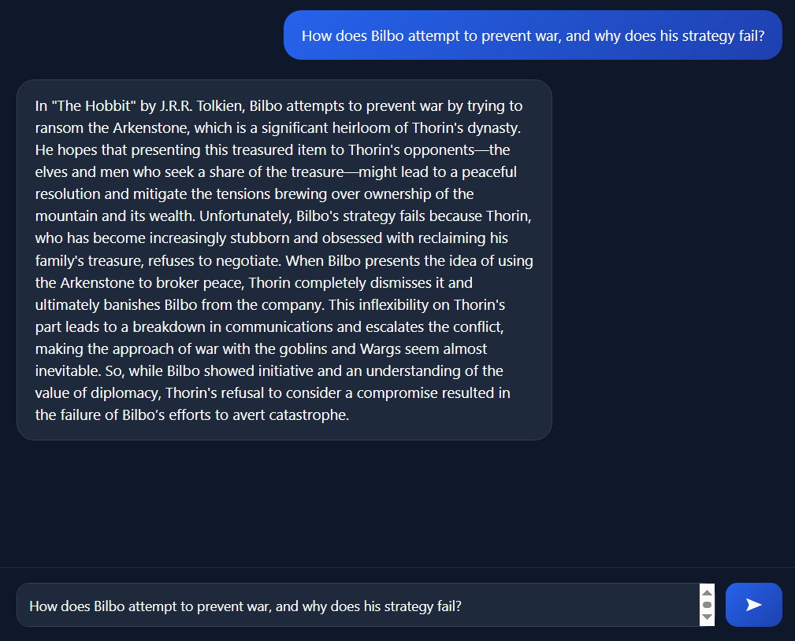

# 📚 BookRetrievalAI – Flexible .NET RAG Chatbot System with Azure OpenAI, Ollama & Qdrant Vector DB

<p align="center">
  
</p>

A modular **Retrieval-Augmented Generation (RAG)** system built with **.NET 9**, powered by **Semantic Kernel**, supporting:

* ☁️ Azure OpenAI
* 🖥 Local LLMs via Ollama
* 🧠 Qdrant Vector Database (Docker)
* 🔄 Configuration-based provider switching
* 🔧 Custom local model & embedding selection

---

# 🚀 What This Project Does

This project implements a complete RAG pipeline:

1. Parse book summaries dataset
2. Chunk content into smaller segments
3. Generate embeddings
4. Store vectors in Qdrant
5. Retrieve relevant chunks
6. Build contextual prompt
7. Generate final answer using selected LLM provider

You can switch between **Azure OpenAI and local Ollama models** without changing code — only configuration.

---

# 🧠 What is RAG?

**Retrieval-Augmented Generation (RAG)** improves LLM responses by:

* Searching relevant information from a vector database
* Injecting that context into the prompt
* Generating grounded, data-aware answers

Instead of relying only on model training data, RAG uses your own dataset.

---

# 🏗 Architecture Overview

```
User Question
      ↓
Embedding Model
      ↓
Qdrant Vector Search
      ↓
Context Builder
      ↓
Prompt Builder
      ↓
Chat Model (Azure or Ollama)
      ↓
Final Response
```

---

# 📦 Technologies Used

## 🧠 Semantic Kernel

Used for:

* Chat completion
* Embedding generation
* Prompt orchestration
* Multi-provider abstraction

---

## ☁️ Azure OpenAI

Default configuration:

* Chat Model: `gpt-4o-mini`
* Embedding Model: `text-embedding-3-small`

⚡ You can change deployment names in `appsettings.json` to use any Azure deployment you create.

---

## 🖥 Ollama (Local Models)

Default configuration:

* Chat Model: `qwen2.5:3b`
* Embedding Model: `nomic-embed-text`

### 🔧 You Can Use ANY Local Model

This system is **not limited** to the default models.

You can use **any chat model or embedding model supported by Ollama**.

Simply update:

```json
"ChatModel": "your-local-chat-model",
"EmbeddingModel": "your-local-embedding-model"
```

As long as the model exists in Ollama, the system can use it.

---

## 🧠 Qdrant

Vector database used to:

* Store embeddings
* Perform similarity search
* Retrieve relevant chunks

Runs locally via Docker.

---

## 🐳 Docker

Required to run Qdrant locally.

---

# 📂 Project Structure

```
Core/
 ├── Interfaces/
 └── Models/

Services/
 ├── Parsing/
 ├── Chunking/
 ├── Indexing/
 ├── Chat/
 ├── BookRagService.cs
 └── BookRagServiceWithOllamaLocalModels.cs
```

### Responsibilities

* **Parsing** → Reads dataset and creates structured records
* **Chunking** → Splits text into embedding-friendly segments
* **Indexing** → Generates embeddings and stores them in Qdrant
* **Chat** → Builds context and prompts
* **Services** → Provider-specific orchestration

---

# ⚙️ Setup Guide

---

## 1️⃣ Install Qdrant (Required)

Run using Docker:

```bash
docker run -p 6334:6333 qdrant/qdrant
```

Qdrant will be available at:

```
http://localhost:6334
```

Your config:

```json
"QdrantEndpoint": "http://localhost:6334"
```

---

## 2️⃣ (Optional) Install Ollama for Local LLM

Download from:

[https://ollama.com](https://ollama.com)

Pull required models:

```bash
ollama pull qwen2.5:3b
ollama pull nomic-embed-text
```

Start Ollama:

```bash
ollama serve
```

Default endpoint:

```
http://localhost:11434
```

---

# 🔄 Configuration Guide

All configuration is controlled via `appsettings.json`.

---

## ☁️ Using Azure OpenAI

```json
"AzureOpenAI": {
  "Endpoint": "https://your-endpoint.openai.azure.com/",
  "ApiKey": "YOUR_API_KEY",
  "ChatDeployment": "gpt-4o-mini",
  "EmbeddingDeployment": "text-embedding-3-small",
  "collectionName": "books",
  "Enabled": true
}
```

Disable Ollama:

```json
"Ollama": {
  "Enabled": false
}
```

---

## 🖥 Using Ollama (Local Mode)

```json
"Ollama": {
  "Endpoint": "http://localhost:11434",
  "ChatModel": "your-model",
  "EmbeddingModel": "your-embedding-model",
  "collectionName": "booksWithOllama",
  "Enabled": true
}
```

Disable Azure:

```json
"AzureOpenAI": {
  "Enabled": false
}
```

---

# 🔁 Switching Providers

No code changes required.

Simply toggle:

```json
"Enabled": true/false
```

The application automatically resolves the correct RAG service.

---

# 📊 Dataset

Default dataset file:

```
dataset/booksummaries.txt
```

### Important

The included dataset contains **100 book summaries**.
It is intentionally small for:

* Fast testing
* Quick indexing
* Development purposes

---

## 📈 Large-Scale Testing Dataset

For high-scale RAG testing, you can download the full CMU Book Summary Dataset:

[https://www.kaggle.com/datasets/ymaricar/cmu-book-summary-dataset](https://www.kaggle.com/datasets/ymaricar/cmu-book-summary-dataset)

This dataset contains thousands of book summaries and is ideal for:

* Performance testing
* Large vector indexing
* Real-world RAG benchmarking

After downloading, update:

```json
"DatasetFilePath": "your-new-dataset-path"
```

---

# 🧩 Core Components Explained

## 📌 BookDataParser

Reads raw dataset and converts it into structured records.

## 📌 BookChunker

Splits content into smaller segments suitable for embeddings.

## 📌 BookIndexer

Generates embeddings and pushes vectors into Qdrant.

## 📌 ContextBuilder

Retrieves top relevant chunks and builds LLM context.

## 📌 PromptBuilder

Constructs final prompt for the chat model.

## 📌 RagChatService

Handles chat completion using selected provider.

---

# 🛠 How to Run

1. Start Qdrant (Docker)
2. (Optional) Start Ollama
3. Configure `appsettings.json`
4. Run project:

```bash
dotnet run
```

---

# 🎯 Key Features

* ✅ Clean layered architecture
* ✅ Provider abstraction
* ✅ Config-based AI switching
* ✅ Supports any local chat or embedding model
* ✅ Works fully local or cloud
* ✅ Vector database integration
* ✅ Dataset-driven RAG pipeline
* ✅ Easily scalable for large datasets

---

# 📌 Notes

* Qdrant must be running before indexing
* Ollama must be running if local mode enabled
* Azure requires valid API key and deployment names
* Collections are separated per embedding model
* When changing embedding models, use a new collection name

---

# 👨‍💻 Author

Built as a modular, extensible RAG system using modern .NET and Semantic Kernel patterns.

---

If you’d like, I can now:

* Turn this into a **portfolio-grade GitHub README with badges**
* Add a professional architecture diagram
* Help you write a LinkedIn post presenting this project
* Help you describe this in a Senior .NET interview context

Just tell me what you’re aiming for 😄
